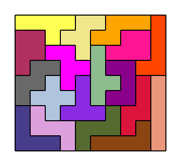

# Tiler

Tiler is a CLI tool for automated solving of [polyomino](https://en.wikipedia.org/wiki/Polyomino)
tiling problems. It features multiple solver backends.

## Usage

The CLI takes input (either from command-line or from a file) which defines a board (region
consisting of unit squares) and polyomino tiles and tries to find a perfect tiling of the board with
the tiles.

The shape of board as well as of each tile can be provided in any of these formats:

- **name**, eg. `3L` (see the `list` command for the list of all named shapes)

- **dimensions**, eg. `2x4` (applicable only for rectangles)

- **map**, eg. this equivalent of `3x2`:

  ```
  xxx
  xxx
  ```

  (useful with the `-f `option)

- **perimeter**, eg. `DDRRULUL` - equivalent of `3L` (crossings of the perimeter are not allowed,
  applicable only for shapes without holes)

You should provide a list of shapes, where the first one represents the board and the others the
tiles. Tile shape may be prefixed with `N:` where `N` is the available number of such tiles
(unlimited if not provided). See the `example` command for input examples.

Run `tiler -h` and `tiler solve -h` to see all options.

### Limitations

Only continuous shapes are allowed.

Solver may rotate the tiles. There is a CLI flag to allow reflections (flipping the tiles over).

## Examples

Here are some example outputs of the solver.

`tiler solve -s 01.svg 11x7 4T 3:3I`\


`tiler solve -s 02.svg 10x9 1:5A 1:5F 1:5G 1:5J 1:5P 1:5S 1:5Y 1:5R 1:5N 1:5L 1:5Q 1:5Z 1:5I 1:5T 1:5U 1:5V 1:5W 1:5X`\


## Build Instructions

Building Tiler requires these dependencies:

- [CMake](https://cmake.org/) build tool (version 3.12 or later)
- [Conan](https://conan.io/) package manager
- a C/C++ compiler (a recent version of GCC is recommended, C++17 support is required)

Build the exacutable by running `./scripts/release-setup.sh` and `./scripts/release-build.sh`. You
can configure build options using eg. `ccmake` before running `release-build.sh` or by adding
appropriate `-D` flags to the `cmake ..` line in `release-setup.sh`.

If you want to use SAT solvers [CaDiCaL](https://github.com/arminbiere/cadical) and/or
[CryptoMiniSat](https://github.com/msoos/cryptominisat), run `./scripts/build-cadical.sh` and
`./scripts/build-cryptominisat.sh` beforehand (or having them installed system-wide should work as
well). Otherwise you need to set CMake options `-DCADICAL=OFF` and `-DCRYPTOMINISAT=OFF`.

Your freshly compiled Tiler executable will be located at `release/bin/tiler`.

This setup is tested on Linux with GCC 10.2.0, but it should work on other platforms, too (maybe
with some minor tweaks).

## Development Setup

In addition to CMake and Conan (see [Build Instructions](#build-instructions)), you should install:

- [ClangFormat](https://clang.llvm.org/docs/ClangFormat.html) code formatter (version 10 or later)
- [Cppcheck](http://cppcheck.sourceforge.net/) static code analysis tool
- [GDB](https://www.gnu.org/software/gdb/) debugger (optional)

Regarding the actual development, using [VS Code](https://code.visualstudio.com/) with the [C/C++
extension](https://marketplace.visualstudio.com/items?itemName=ms-vscode.cpptools) is recommended -
this way, you can use the IDE tasks, the built-in debugging UI and utilize proposed
[VS Code settings](./.vscode/example.settings.json). If you intend to use other editor/IDE, all
commands to run can be found at [tasks.json](./.vscode/tasks.json).

---

## License

Tiler is licensed under the [GNU GPL license v3](./LICENSE).

```
Tiler - tool for automated solving of polyomino tiling problems
Copyright (C) 2020  David Misiak

This program is free software: you can redistribute it and/or modify
it under the terms of the GNU General Public License as published by
the Free Software Foundation, either version 3 of the License, or
(at your option) any later version.

This program is distributed in the hope that it will be useful,
but WITHOUT ANY WARRANTY; without even the implied warranty of
MERCHANTABILITY or FITNESS FOR A PARTICULAR PURPOSE.  See the
GNU General Public License for more details.

You should have received a copy of the GNU General Public License
along with this program.  If not, see <http://www.gnu.org/licenses/>.
```
